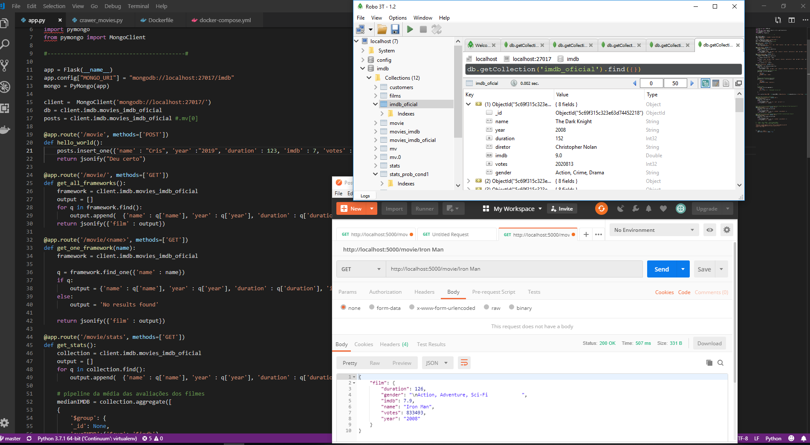

# IMDB crawer

# 

### Contexto da Aplicação
IMDB Crawer

| Aplicação                     | Versão        |
| :---------------------------- |:-------------:|
| IMDB Crawer                 | 1.0.0           |

- Projeto feito usando o python mongo:4.0.6 e python:3.7.2

## Dependências
- Flask >= 1.0.2
- Flask-Cors >= 3.0.7
- Flask-PyMongo >= 2.2.0
- pymongo >= 3.7.2
- requests==2.21.0
- request==2018.11.20
- bs4==0.0.1
- ipython==7.2.0
- ipython-genutils==0.2.0 
- pytest==3.6.1

## Resumo

#### - Crie um projeto em seu Git Pessoal com Acesso Público                                                                          

1 - Desenvolva um Crawler para obter informações do Banco de Dados de Filmes do Site "IMDB.com"                                      OK

1.1 - Deve ser utilizado a linguagem de Programação Python                                                                           OK

1.2 - Não deve ser utilizado frameworks como Scrapy/Selenium (utilizar de preferência resquests)                                     OK

1.3 - Obter uma lista de pelo menos 5000 títulos                                                                                     OK

1.4 - Persistir as informações em formato Json (utilização de MongoDB será um diferencial)                                           OK

1.5 - Baixar o máximo de variáveis possíveis a serem utilizadas em um modelo estatístico                                             OK

1.6 - Desenvolver um teste unitário que verifique o processo "chave" de obtenção dos dados                                           FALTA

2 - Disponibilizar um serviço Web que retorne informações dos títulos obtidos                                                        OK

2.1 - Utilizar Flask ou Tornado                                                                                                      OK

3 - Desenvolver um conjunto de algoritmos implementando cálculos básicos de estatística (média, desvio padrão, teorema de Bayes etc). 

#### - Obs.: Não utilizar do Numpy ou Pandas ou qualquer outro framework matemático

- Responda:

3.1 - Qual a probabilidade de uma mulher ser diretora do filme?                                                                        FALTA

3.2 - Qual o tempo de duração médio dos filmes obtidos?                                                                                 OK

3.3 - Qual a probabilidade de cada filme em seu gênero ter uma avaliação superior a 8?                                                  OK

3.4 - Qual a probabilidade de um filme ter avaliação superior a 8, considerando que ele não possui um diretor americano?                FALTA

3.5 - Quais são os diretores preferidos?                                                                                                OK

4 - Criar um script de instalação dos códigos acima em um DockerFile                                                                    OK

4.1 - Expor o serviço Web (Etapa 2)                                                                                                     OK

4.2 - Possibilitar a avaliação dos resultados via Docker (Logs, Serviços Web ou o que preferir)                                         FALTA

## Como rodar
 - pip install pytest coverage pytest-cov flask     # Instalando lib de teste
 - python test_core.py                              # testando APP
 - docker-compose up --build __ na pasta
 - python crawer_movies.py
 - python app.py
## Testando a aplicação

 - '/movie/'                               #  Retorna todos os filmes.
 - '/movie/<name>'                         # Retorna um filme.
 - /movie/stats'                           # Retorna estatísticas dos filmes como: avaliação média IMDB, média de duração.
 - /movie/stats_diretor                    # Diretores favoritos, que fizeram mas filmes
 - /movie/stats_prob1                      # prob. de um filme de um determinado gênero ter avaliação maior do que 8 dentre os filmes com avaliaçaõ >8
 - /movie/stats_prob2                     # prob. de um filme ser escolhido ter avaliação maior do que 8 dado que um filme tem avaliaçaõ >8
  
  
  
  
  
  

 
